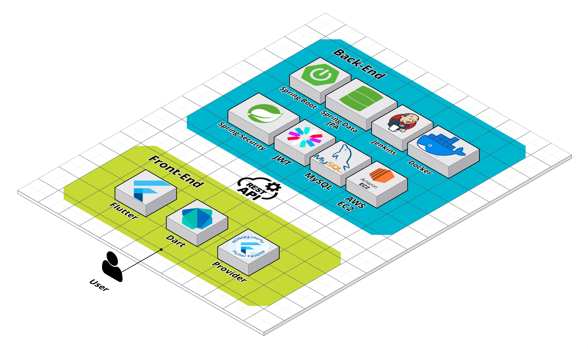
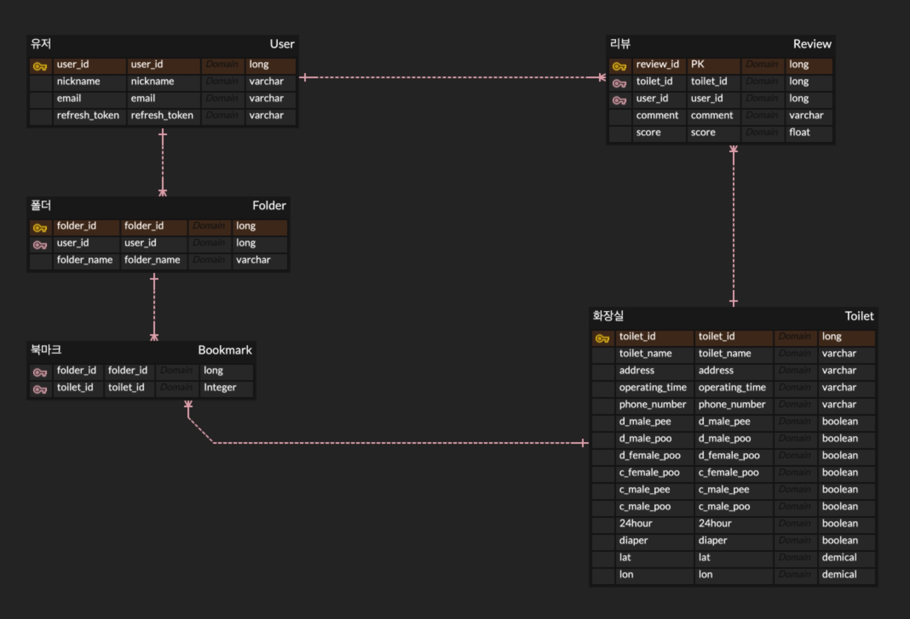
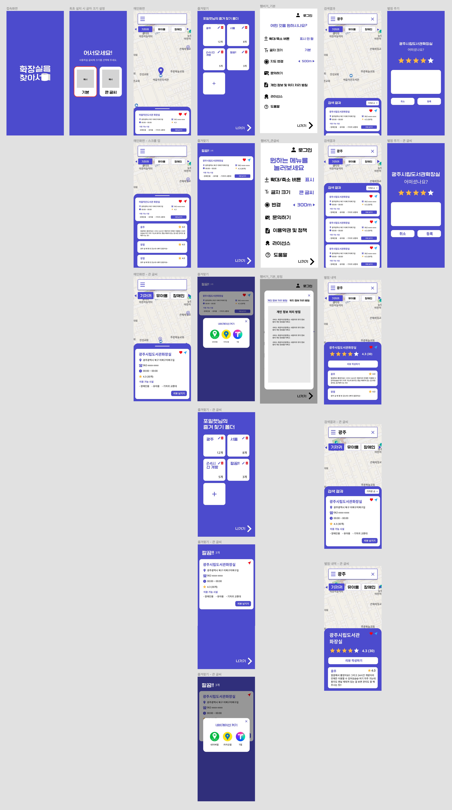

# 🔎 화장실을 찾아서 (Find Toilet) 

## 목차
[1. 소개](#1️⃣-소개)

[2. 일정](#2️⃣-일정)

[3. 시스템 아키텍처](#3️⃣-시스템-아키텍처)

[4. 기능](#4️⃣-기능)

[5. 개발 환경](#5️⃣-개발-환경)

[6. 참고 자료](#6️⃣-참고-자료)

[7. 개발팀 소개](#7️⃣-개발팀-소개)

---

## 1️⃣ 소개
- 낯선 곳에서, 혹은 급한 상황에서 화장실을 찾지 못해 당황스러웠던 적이 있진 않으신가요?
- **화장실을 찾아서**는 그런 상황에서 유용하게 활용할 수 있도록 **공공화장실 정보**를 제공하는 애플리케이션입니다.
- 24시간 운영 유무, 장애인용 화장실 유무 등 **필터링 기능**을 제공하여 현재 필요한 화장실을 정확하게 찾을 수 있습니다.
- 자주 이용하는 곳은 **리뷰**를 남기고, **즐겨찾기**해보세요!

### 🔗 [앱 다운 받기]()

 

## 2️⃣ 일정

> 총 개발 기간 : 2023.01.25 ~ 2023.04.nn (약 n주 소요) 
- 2023.01.25 ~ 2023.02.12 : 기획 및 UI 디자인 (약 2주 소요)
- 2023.02.13 ~ 2023.04.nn : FE/BE 개발 (약 3주 소요)
- 2023.04.nn ~ 2023.04.nn : QA 및 마켓 등록

## 3️⃣ 시스템 아키텍처

 

## 4️⃣ 기능
### 내 주변 화장실 찾기
- 나의 GPS를 기반으로 주변 화장실을 찾아볼 수 있습니다.
- 필터링 기능을 제공합니다. ( 24시간 / 장애인용 / 어린이용 / 기저귀 교환대 )

### 검색
- 검색을 통해 화장실을 찾아볼 수 있습니다.
- 필터링 기능을 제공합니다. ( 24시간 / 장애인용 / 어린이용 / 기저귀 교환대 )
- 검색 결과의 정렬 기준을 선택할 수 있습니다. ( 거리순 / 평점순 / 리뷰순 )

### 즐겨찾기
- 자주 가는 곳을 즐겨찾기할 수 있습니다.
- 폴더를 만들어 즐겨찾기를 관리할 수 있습니다.

### 설정
- 큰 글씨 모드와 반경 설정 기능을 제공합니다.
- 문의하기를 통해 개발팀 포일렛에 관련 문의를 남길 수 있습니다.

 

## 5️⃣ 개발 환경
| Part | Tech |
| :--: | :--: |
| **Front-End** |   |
| **Back-End** |     |
| **Deployment** |   |
|**Communication**|    |

 

## 6️⃣ 참고 자료
### 1️⃣ ERD 다이어그램

### 2️⃣ 와이어프레임

### 3️⃣ Swagger 🔗 [Link](http://43.201.124.70:8080/swagger-ui/)

 

## 7️⃣ 개발팀 소개
|||||
|:---:|:---:|:---:|:---:|
|**Backend**|**Backend**|**Frontend**|**Frontend**|
|[김윤주](https://github.com/gimewn)|[나장엽](https://github.com/kaydenna92)|[나원경](https://github.com/hitriee)|[박한](https://github.com/Hanpark04)|

